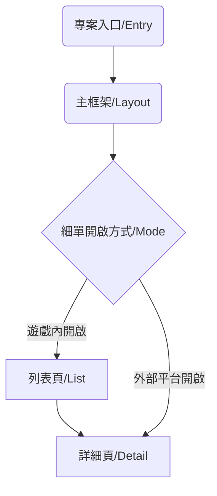

# 新版細單v2.0介紹

**BN79以前**使用舊版細單，路徑如下：
https://{BaseUrl}/game/Entry/gameDetail/#/{slotDetail 或 fishDetail }/?{query參數}

**BN80以後**的遊戲使用新版細單v2.0，路徑如下：
https://{BaseUrl}/game/GameCommon/GameResult/{BN**}.html/?{query參數}

---

## ＃ 架構流程圖

- **Entry**：src/project/BN{ID}/app.vue 各專案入口頁。
- **Layout**：src/layout/Main.vue 專案app.vue引入layout/main.vue主框架。
- **Mode**：由Vuex(src/store/index.js)引入baseInfo（src/utils/baseInfo.js）判斷細單是由內部遊戲或外部平台開啟。
- **List**：src/layout/List.vue若細單由遊戲內部開啟，則顯示列表頁後再進入詳細頁。
- **Detail**：src/layout/Detail.vue若細單由外部平台開啟，則直接顯示詳細頁。

---

## ＃ 本地開發流程

1. 更新遊戲清單：新增[gameList.json](http://gitlab.msslot.bet/release/gamelist)遊戲資訊並更新。
2. 新增專案symbol圖：圖片位置 src\assets\images\{BN**}\
3. 新增LineGame賠付線譜：src\utils\paylinesData.js
4. 創建新專案（專案類型可參考demo分支）。
5. 設定token：使用[QA工具](https://assets.msgdev.info/game/qatool/#/) 取得遊戲token並在app.vue入口頁設定。

---

## ＃ 專案參考範例（分支：demo）

- BN09：切換盤面按鈕（左右切換）PS：僅示意盤面左右切換功能，非BN09正式細單完整結構。
- BN10：Line Game模式。
- BN16：Way Game模式。
- BN54：變牌盤面（箭頭表示）。
- BN82：新版遊戲模式。

